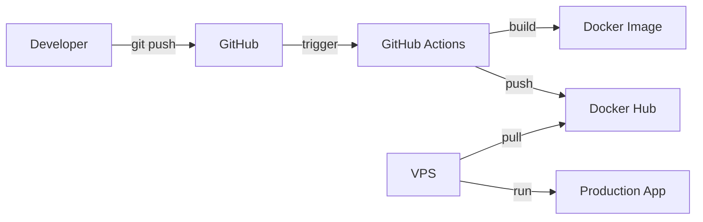

# Docker Hub Deployment Guide

Deploy Paste-Bin using pre-built images from Docker Hub. This eliminates the need to build on your VPS, making deployments instant.

## Benefits

- **Instant Deployments**: Pull pre-built images instead of building (seconds vs 15-30 minutes)
- **Consistent Builds**: Same image across all environments
- **Lower VPS Requirements**: No need for extra RAM during builds
- **Automatic Updates**: GitHub Actions builds and pushes on every commit to main

## Setup

### 1. Configure Docker Hub Secrets (One-Time Setup)

You need to add your Docker Hub credentials to GitHub:

1. **Create Docker Hub Access Token**:
   - Go to [Docker Hub Settings → Security](https://hub.docker.com/settings/security)
   - Click "New Access Token"
   - Name: `GitHub Actions`
   - Permissions: `Read, Write, Delete`
   - Copy the generated token (you won't see it again!)

2. **Add Secrets to GitHub**:
   - Go to your GitHub repo → Settings → Secrets and variables → Actions
   - Click "New repository secret"
   - Add two secrets:
     - `DOCKERHUB_USERNAME`: Your Docker Hub username
     - `DOCKERHUB_TOKEN`: The access token you just created

3. **Trigger Initial Build**:
   ```bash
   # Commit and push to trigger the build
   git push origin main
   ```
   
   Or manually trigger from GitHub:
   - Go to Actions → "Build and Push to Docker Hub" → "Run workflow"

### 2. Deploy to VPS Using Pre-built Image

```bash
# SSH into your VPS
ssh root@your_server_ip

# Clone repository (if not already done)
git clone https://github.com/Abdullah-AboOun/Paste-Bin.git /opt/paste-bin
cd /opt/paste-bin

# Create environment file
cp .env.prod.example .env.prod
nano .env.prod  # Set your POSTGRES_PASSWORD

# Pull and start services (instant!)
docker compose -f docker-compose.yml -f docker-compose.prod.yml --env-file .env.prod pull
docker compose -f docker-compose.yml -f docker-compose.prod.yml --env-file .env.prod up -d

# Check status
docker compose ps
```

Done! Your app is live at `http://your_server_ip:3000` 🎉

## Daily Operations

### Update to Latest Version

```bash
cd /opt/paste-bin
git pull origin main
docker compose -f docker-compose.yml -f docker-compose.prod.yml pull
docker compose -f docker-compose.yml -f docker-compose.prod.yml up -d
```

### Use Specific Version

```bash
# Set custom image in .env.prod
echo "DOCKER_IMAGE=abdullahcg/paste-bin:v1.2.3" >> .env.prod

# Or use git commit SHA
echo "DOCKER_IMAGE=abdullahcg/paste-bin:main-abc1234" >> .env.prod

# Deploy
docker compose -f docker-compose.yml -f docker-compose.prod.yml --env-file .env.prod up -d
```

### Rollback to Previous Version

```bash
# Find available tags
docker search abdullahcg/paste-bin

# Use previous version
DOCKER_IMAGE=abdullahcg/paste-bin:main-previoussha docker compose -f docker-compose.yml -f docker-compose.prod.yml up -d
```

## Custom Docker Hub Repository

If you forked this repo and want to use your own Docker Hub account:

1. **Update Image Name**:
   ```bash
   # Edit docker-compose.prod.yml
   nano docker-compose.prod.yml
   
   # Change:
   image: ${DOCKER_IMAGE:-abdullahcg/paste-bin:latest}
   # To:
   image: ${DOCKER_IMAGE:-yourusername/paste-bin:latest}
   ```

2. **Update GitHub Workflow**:
   ```bash
   # Edit .github/workflows/docker-publish.yml
   nano .github/workflows/docker-publish.yml
   
   # The IMAGE_NAME will automatically use your GitHub username
   # Or you can set it explicitly:
   IMAGE_NAME: yourusername/paste-bin
   ```

3. **Add Your Docker Hub Secrets** (see Setup section above)

4. **Push to Trigger Build**:
   ```bash
   git add .
   git commit -m "Update Docker Hub configuration"
   git push origin main
   ```

## Troubleshooting

### Image Not Found
```bash
# Verify image exists on Docker Hub
docker search abdullahcg/paste-bin

# Or check GitHub Actions for build errors
# Go to: GitHub repo → Actions tab
```

### Authentication Required
```bash
# Login to Docker Hub (if pulling private images)
docker login
```

### Build Not Triggering
- Check GitHub Actions tab for errors
- Verify Docker Hub secrets are set correctly
- Ensure you pushed to `main` branch

### Using Local Build Instead
```bash
# If you want to build locally instead of pulling
cd /opt/paste-bin

# Comment out the 'image:' line in docker-compose.prod.yml
# Then build and start
docker compose -f docker-compose.yml -f docker-compose.prod.yml --env-file .env.prod up -d --build
```

## Architecture



1. Developer pushes code to GitHub
2. GitHub Actions automatically builds Docker image
3. Image is pushed to Docker Hub
4. VPS pulls pre-built image from Docker Hub
5. App runs in seconds (no build needed)

## Cost

- **Docker Hub**: Free for public images (unlimited pulls)
- **GitHub Actions**: Free for public repos (2,000 min/month for private)
- **VPS**: Same as before ($6-12/month)

Total additional cost: **$0** 🎉
